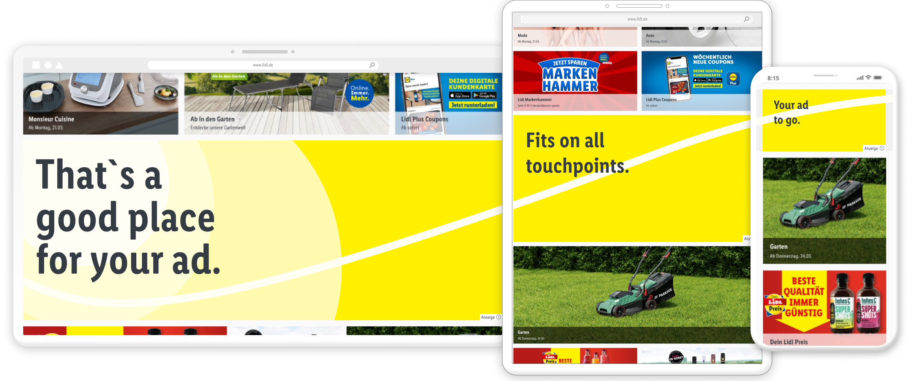

# Getting started with ads

High quality ads ensure a high quality customer experience. These guidelines are going to help you create optimized ads for LIDL websites. Specifications and examples for each type of ad can be found in their corresponding individual sections. All ads are linked to internal LIDL websites only.

## Ad Policy

### Overview

This ad policy provides guidance on what content is allowed to run through our ad platform. We believe all ads should be high-quality, brand conform, and compliant with all local laws. That’s why we outlined the following ad policy to promote a positive user experience for both our customers and our advertisers.
We retain the right to review and remove ads that do not comply with this policy.

Laws about competition and media state the following requirements for advertisements:

- **Separation requirement:** Advertisements must be separated from editorial content.
- **Labelling requirement:** Advertisements must be marked with the word "advertisements" or "advertising".
- **Transparency requirement:** Identity of the company behind the advertisement must be visible on the advertisement or the advertisement must be linked to the website that shows the company identity.
- Depending on the advertising, the content may have to comply with special regulations (e.g. youth protection law, price quotation regulation)
- Advertisements are linked with **internal** LIDL websites only. There are no external links!
- Legal requirements of each country should be proofed.

### 1.0 Campaign Considerations

All ads should comply with local laws. As such, we have country-specific rules that impact who can advertise and how they can target.
As stated, we reserve the right to remove ads that do not comply with any local or international law.

### 2.0 Visual Guidelines

We want all ads to promote a positive user experience. They should be visually appealing, while not distracting or detracting from their surrounding content.

- **LIDL Font Condensed Pro** must be used for additional texts.
- **LIDL price boxes** must be used when prices are used.
- **No asterisk** and/or **legal texts** in the ad.
- **Call to actions** must be in the foreground.
- **Full background** must be used.
- **Font size and contrast** must be clearly recognizable.
- **Data specification:** The size of each asset shouldn’t be above ~200kb.
<!--**2.7 Creative Dimensions** -  
**2.8 Image Quality** -  
3.0 Ad Copy Guidelines-->

### 3.0 Ad copy should be relevant, timely, and accurate. We prohibit:

- **Untimely messaging:** Promotions should be consistent with current date/time and not expired.
- **Inaccurate messaging:** Ads should be honest and correct.
- **Claims:** Any claim you make must be substantiated, such as a specific deal or use of the words “new” and “best.”
- **Merchant branding:** Ads should not infringe upon LIDLs brand or trademarks. Your ad should have your logo or name in a prominent position.
<!--3.5 [Other]: [Add any other copy guidelines you have, such as CTAs, language, wording, and so on]-->

### 4.0 Restricted Content

**We prohibit ads promoting or condoning:**

- **Violence:** We prohibit ads for weaponry of any kind. Do not show ads promoting products, services, or news related to violence.
- **Substance abuse:** Do not show ads for alcohol or drugs.
- **Sexual content:** We prohibit ads for sexual services, websites, or practices, including sexually explicit images.
- **Degrading/ discriminatory content:** Ads should not promote racism, sexism, homophobia, eating disorders, transphobia, or hate speech of any kind.
- **Illegal or harmful financial services**
- **Non-certified medical products or services:** All medical ads must be for legal and safe medical practices.
- **Gambling:** Gambling ads should only run in locations where gambling is legal.
- **Political content:** Ads should not endorse/oppose candidates, policies, or practices by governments.
- **Religious content:** We prohibit religious ads of any kind.
- **False destinations:** Users should arrive at the same landing page with your ad that your ad copy promotes.
- **Profanity:** Do not use or imply profanity or profane acronyms.
- **Misinformation**

**We reserve the right to remove ads that do not align with our company values and services.**

---

## Ad location

Select the perfect spot for the placement of your ad. Read on the specifications for:

[Desktop Billboard Ad](../Placement/Desktop%20Billboard%20Ad/Desktop%20Billboard%20Ad.md) 
[Hero Stage Ad](../Placement/Hero%20Stage%20Ad/Hero%20Stage%20Ad.md) 
[Mobile Content Ad](../Placement/Mobile%20Content%20Ad/Mobile%20Content%20Ad.md) 
[Product Listing Ad](../Placement/Product%20Listing%20Ad/Product%20Listing%20Ad.md) 

Each placement section contains ad templates which can be downloaded to help you in design of your ads.

---

>Need informations about app ads? Follow the [app ads guidance](/Lidl/App/Ads/Getting_started/Introduction.md).
