# Desktop Billboard Ad

A banner for tablet and desktop devices with high-visibility according to IAB standards. 
For mobile devices the [Mobile Content Ad](../Mobile%20Content%20Ad/Mobile%20Content%20Ad.md) will be used.

---

## Specifications

Type | Value
---|---|
Display size | 970x250 px
Retina size | 1.940x500 px
Font size | min. 14 px *
File size | max. 200 kb
File format | jpg, png

*The smallest text size shouldn’t be optically smaller than ad-tag text.*

---

### Safe zone

Type | Attributes | Preview
---|---|---
Margin | margin: 20 px | 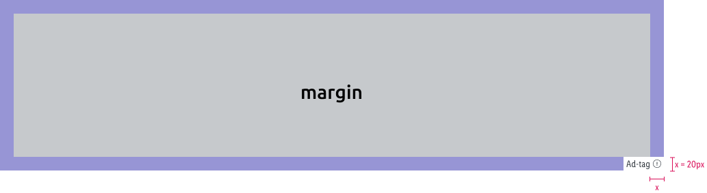
Min-width | min-width: 584 px | 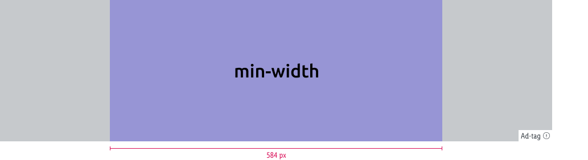

Please consider that images will be cropped left and right to align with the viewport.
Try to place your key visual elements around the central part of the ad space.

---

### Examples

Type | SM | MD | LG
---|---|---|---
Start page | 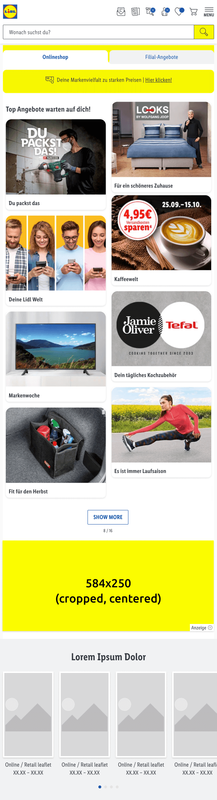 | 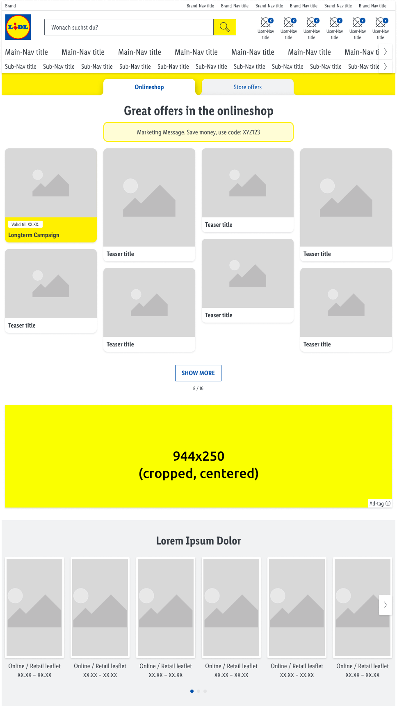 | 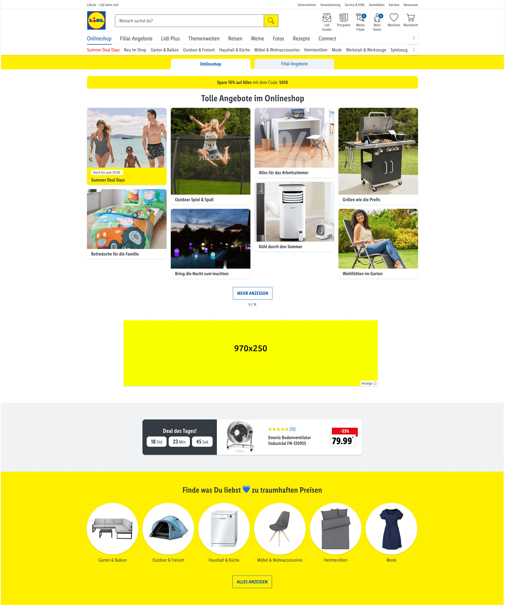
Campaign page | 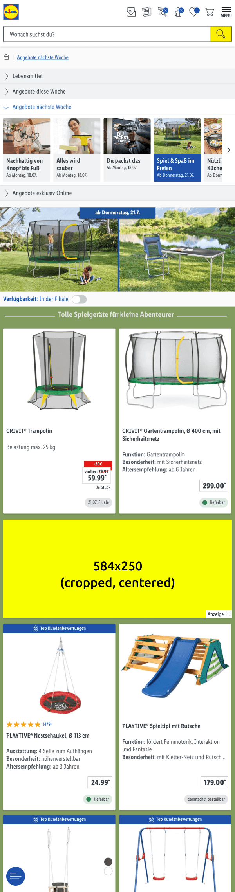 | 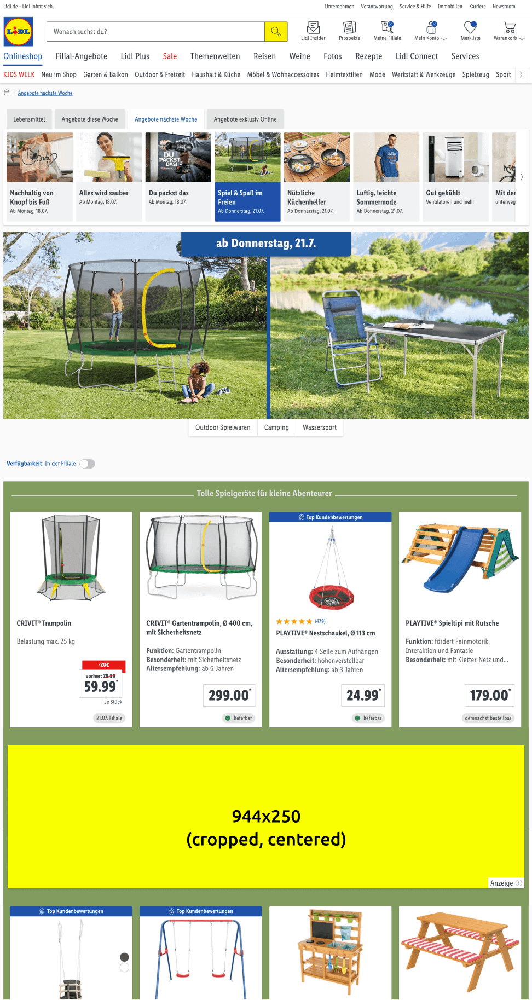 | 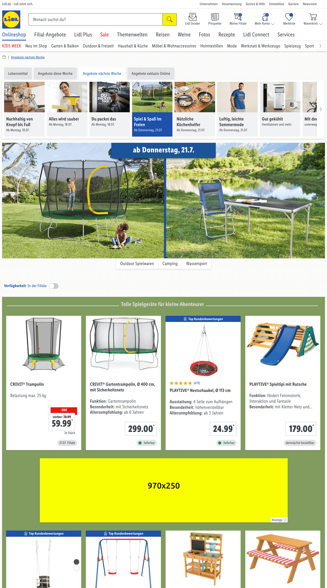
Category page | 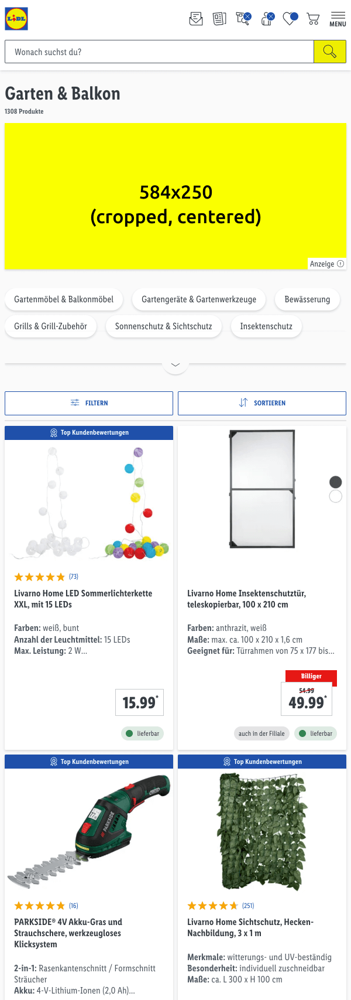 | 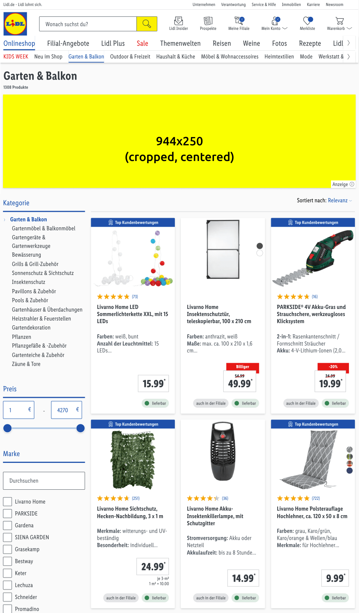 | 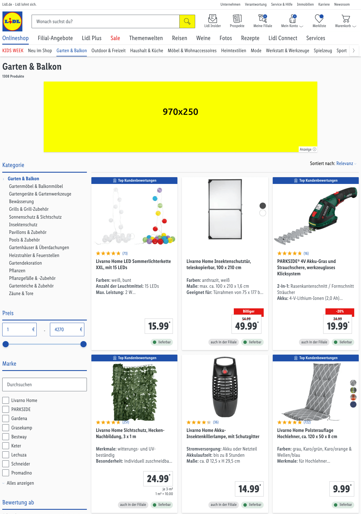
Search page | 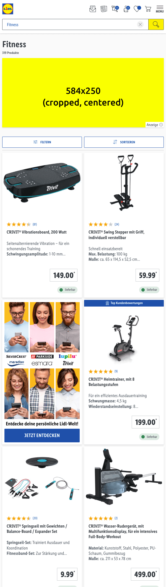 | 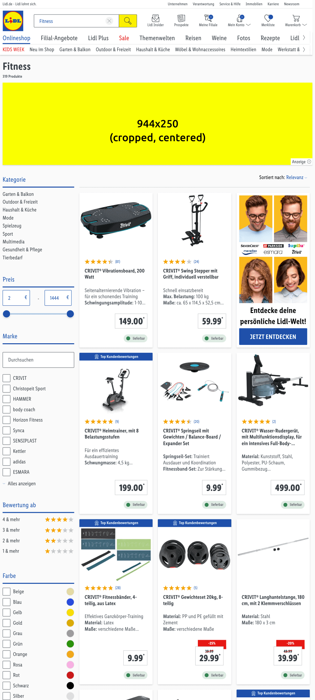 | 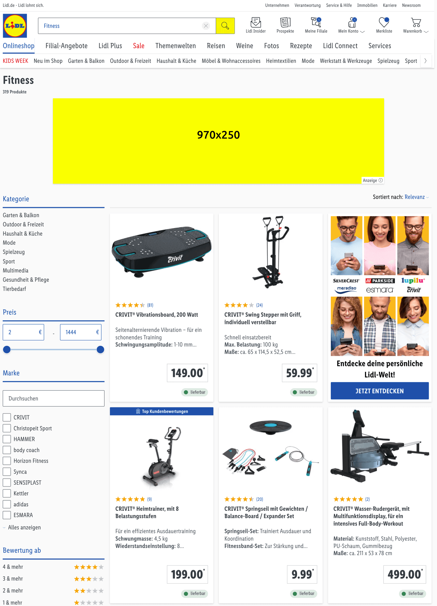

*Click on the image in the table to see it in the full screen mode.*

---

## Asset template

[Billboard Ad template (PSD file)](https://storage.cake.schwarz/SMP/web-template-billboard.psd)
