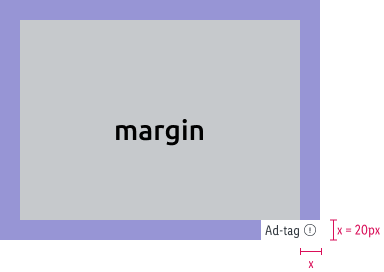
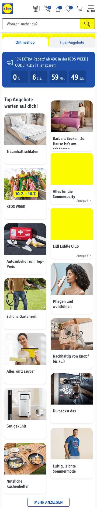
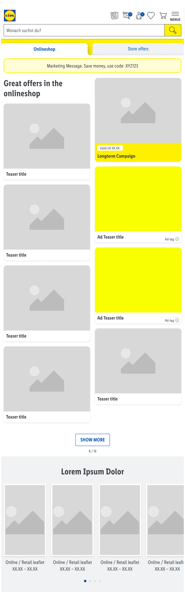
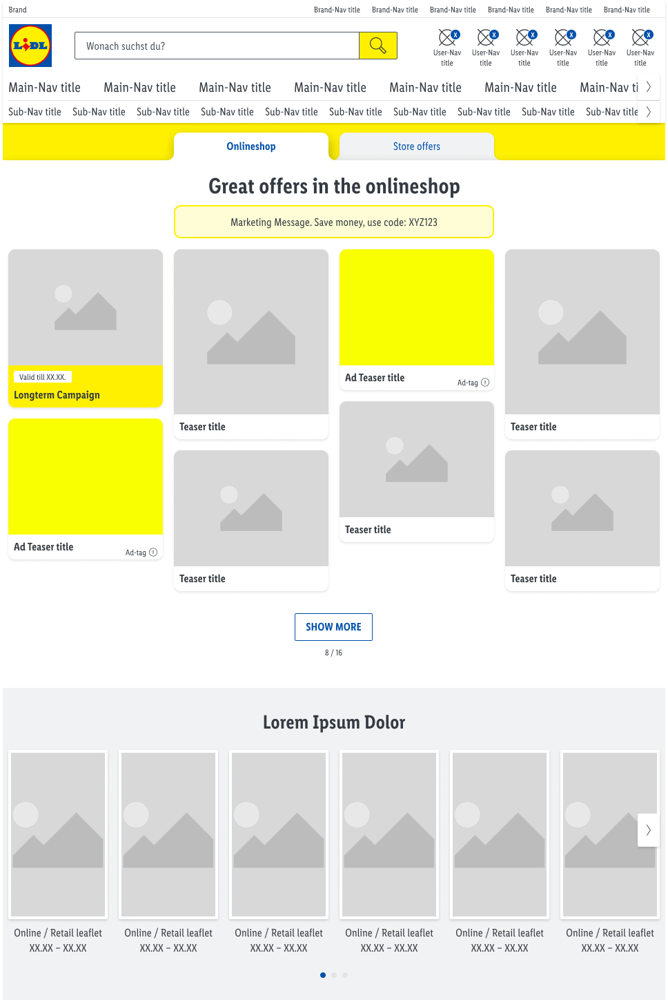
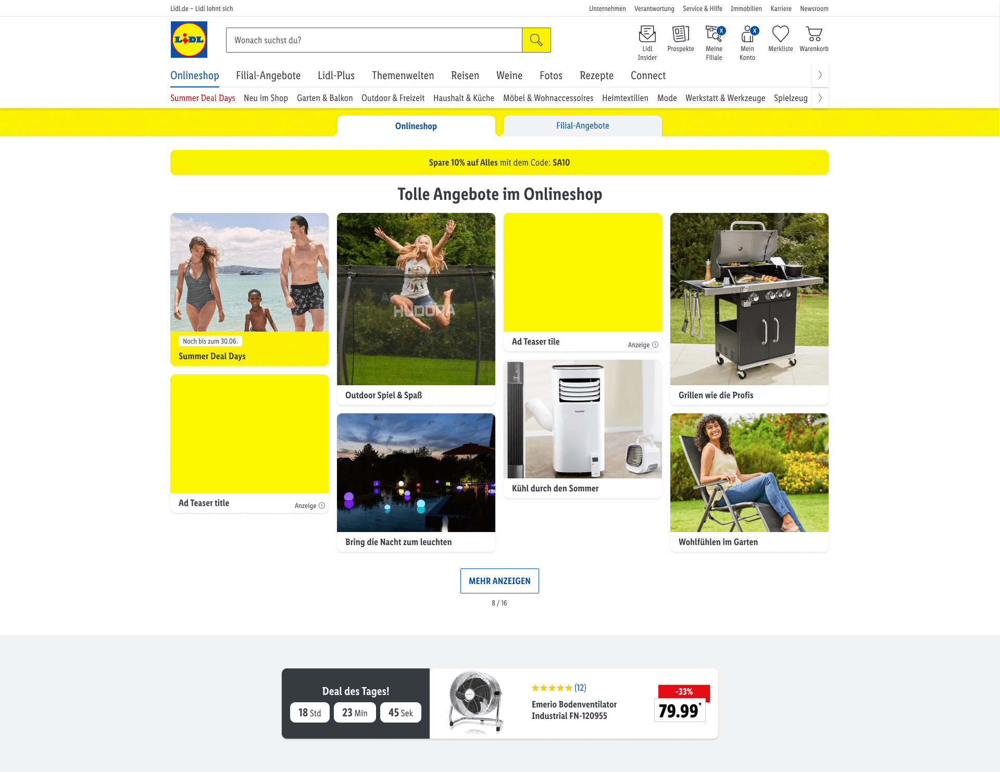

# Hero Stage Ad

A 4:3 banner for mobile, tablet and desktop devices within the hero stage.

---

## Specifications

Type | Value
---|---|
Display size | 320x240 px
Retina size | 640x480 px
Font size | min. 12 px *
File size | max. 200 kb
File format | jpg, png

*The smallest text size shouldn’t be optically smaller than ad-tag text.*

---

### Safe zone

Type | Attributes | Preview
---|---|---
Margin | margin: 20 px | 

Image assets scale proportionally in height and width according to the viewport size.
Try to place your key visual elements around the central part of the ad space.

---

### Examples

Type | XS | SM | MD | LG
---|---|---|---|---
Start page |  |  |  | 

*Click on the image in the table to see it in the full screen mode.*

---

## Asset template

[Hero Stage Ad template (PSD file)](https://storage.cake.schwarz/SMP/web-template-heroStage.psd)
