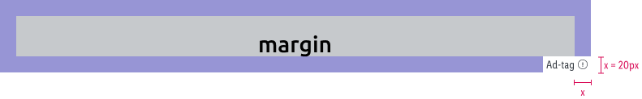
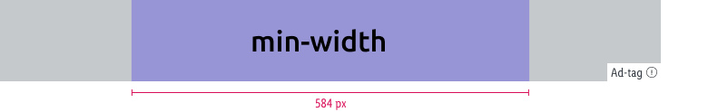
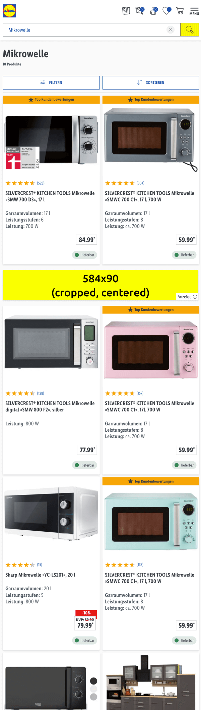
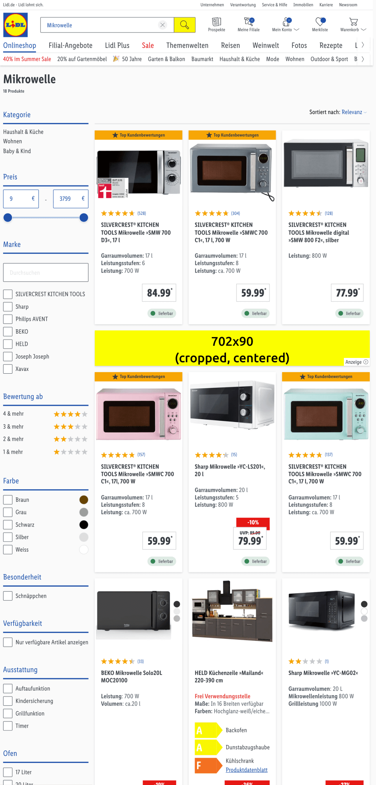
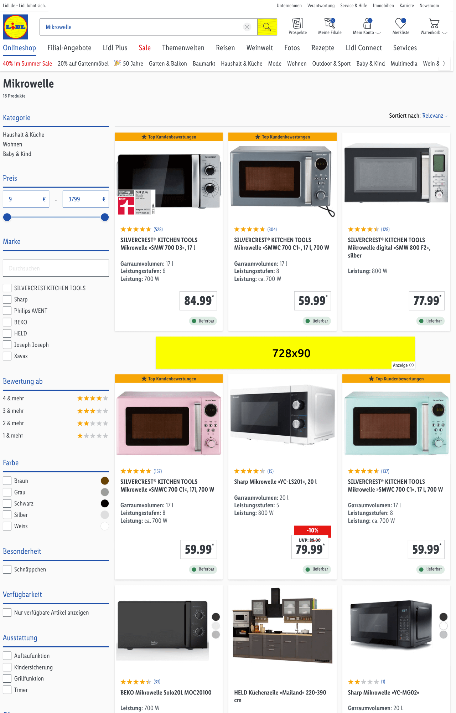

# Leaderboard Ad

A banner for tablet and desktop devices with high-visibility according to IAB standards. 
For mobile devices the [Smartphone Banner Ad](../Smartphone%20Banner%20Ad/Smartphone%20Banner%20Ad.md) will be used.

---

## Specifications

Type | Value
---|---|
Display size | 728x90 px
Retina size | 1.456x180 px
Font size | min. 14 px *
File size | max. 200 kb
File format | jpg, png

*The smallest text size shouldn’t be optically smaller than ad-tag text.*

---

### Safe zone

Type | Attributes | Preview
---|---|---
Margin | margin: 20 px | 
Min-width | min-width: 584 px | 

Please consider that images will be cropped left and right to align with the viewport.
Try to place your key visual elements around the central part of the ad space.

---

### Examples

Type | SM | MD | LG
---|---|---|---
Search & Category page |  |  | 

*Click on the image in the table to see it in the full screen mode.*

---

## Asset template

[Leaderboard Ad template (PSD file)](https://storage.cake.schwarz/SMP/web-template-leaderboard.psd)
