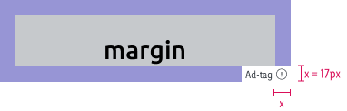
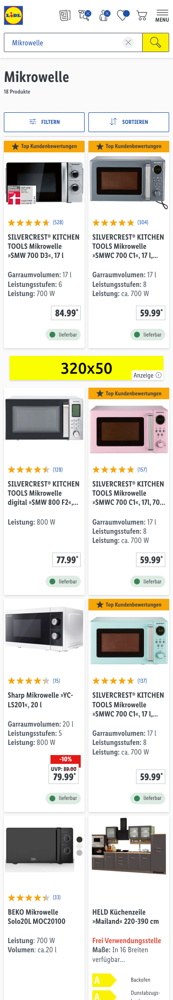

# Smartphone Banner Ad

A banner for mobile devices with high-visibility according to IAB standards.
For tablet and desktop devices the [Leaderboard Ad](../Leaderboard%20Ad/Leaderboard%20Ad.md) will be used.

---

## Specifications

Type | Value
---|---|
Display size | 320x50 px
Retina size | 640x100 px
Font size | min. 12 px *
File size | max. 200 kb
File format | jpg, png

*The smallest text size shouldn’t be optically smaller than ad-tag text.*

---

### Safe zone

Type | Attributes | Preview
---|---|---
Margin | margin: 17 px | 

Try to place your key visual elements around the central part of the ad space.

---

### Example

Category & Search page |
---|---
 |

*Click on the image in the table to see it in the full screen mode.*

---

## Asset template

[Smartphone Banner Ad template (PSD file)](https://storage.cake.schwarz/SMP/web-template-smartphonebanner.psd)
